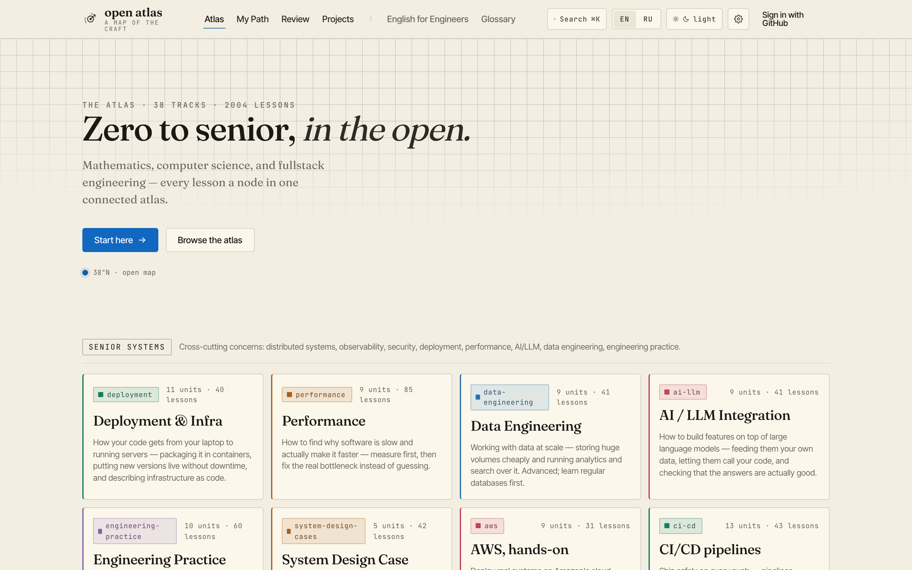
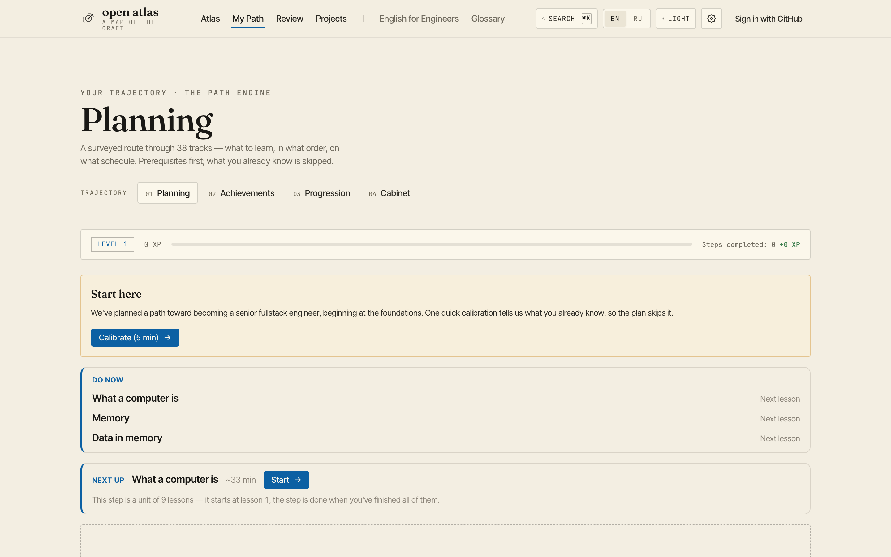
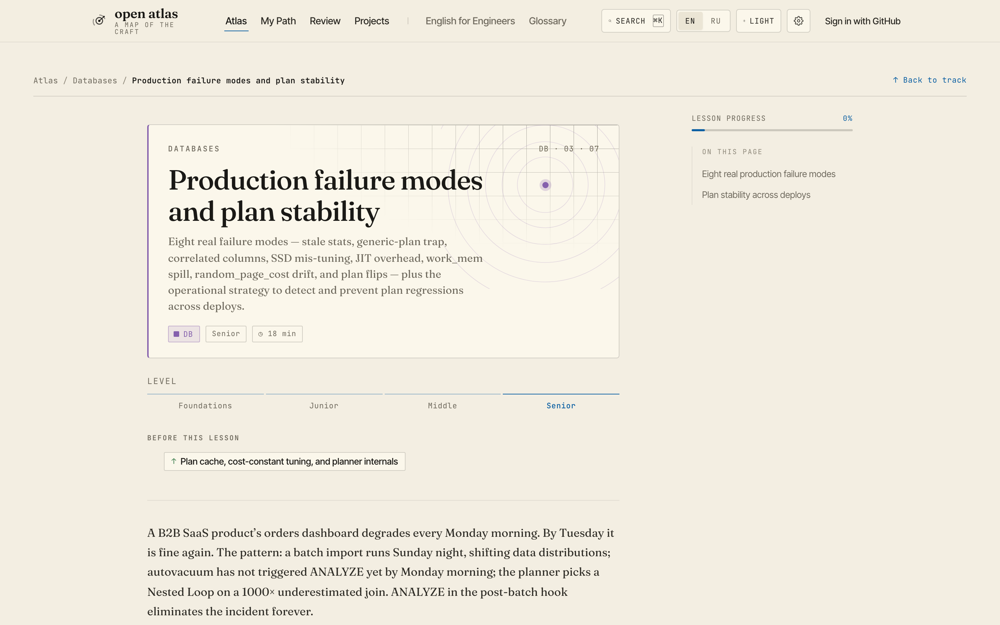
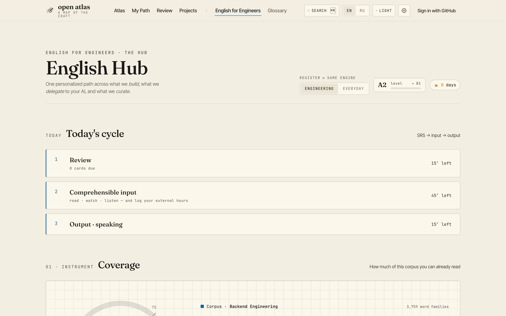
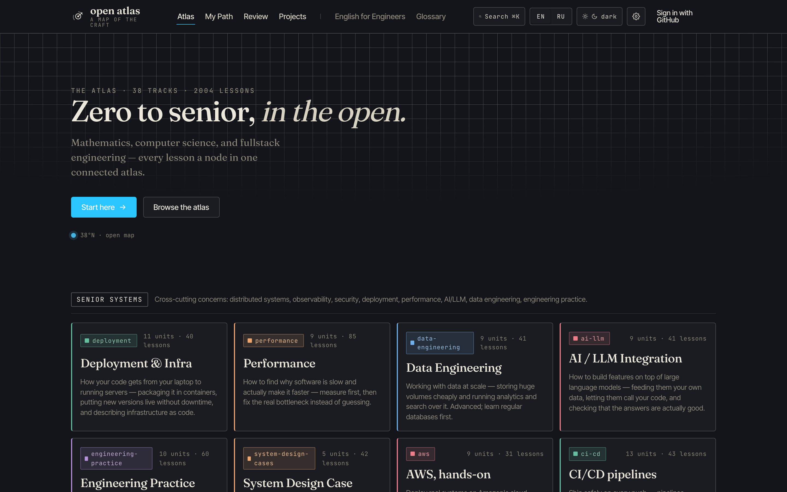
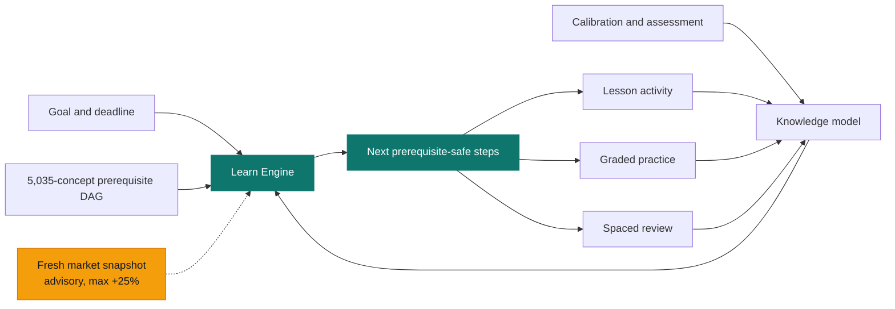
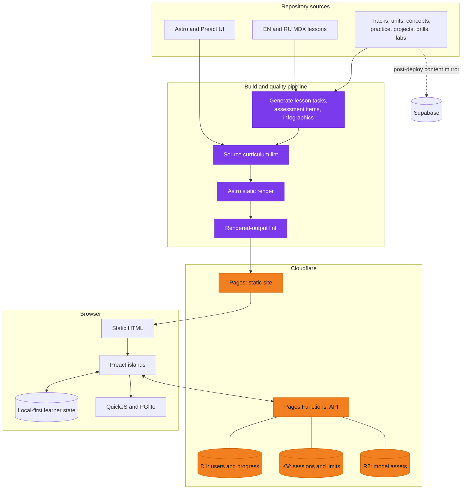
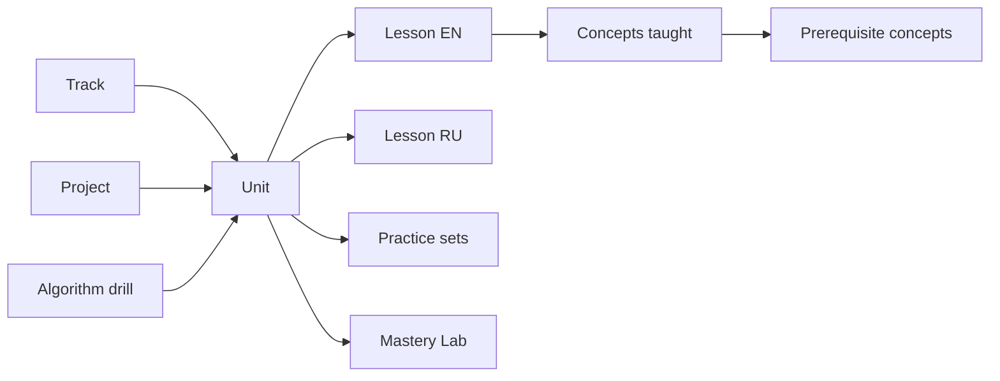
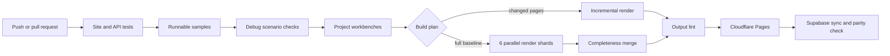

<div align="center">


# Skein

### A connected learning atlas for becoming a senior fullstack engineer

**44 tracks · 440 units · 2,264 lessons in each language · 5,035 concepts · EN/RU parity**

Skein turns a large engineering curriculum into a personal route: it measures what you know, respects prerequisite dependencies, schedules practice and review, and recommends the next highest-value step toward your goal.

[](https://fallowlone.com)
[](./LICENSE)
[](./LICENSE-CONTENT.md)

[](https://astro.build)
[](https://preactjs.com)
[](https://bun.sh)
[](https://pages.cloudflare.com)
[](#content-model)

**[Start learning](https://fallowlone.com/en/)** · **[Русская версия](https://fallowlone.com/ru/)** · [Build a learning path](https://fallowlone.com/en/roadmap) · [Open Algorithm Workspace](https://fallowlone.com/en/algorithm-workspace)

<br />

<a href="https://fallowlone.com/en/">
  
</a>

</div>

---

## What Skein is

Most courses are ordered playlists. Skein is a **dependency graph with a feedback loop**.

Every lesson belongs to a track and unit, teaches explicit concepts, and is connected to prerequisites. The Learn Engine combines this graph with diagnostics, graded practice, review history, learner goals, available time, and a deliberately weak market-demand signal. The result is not a generic roadmap; it is a route that changes as the learner changes.

> The curriculum targets **middle+/senior depth**: mechanism, trade-off, failure mode, and production numbers. If a lesson only restates documentation, it is not deep enough.

### Current corpus

| | Current state |
|---|---:|
| Tracks | **44** |
| Units | **440** |
| English lessons | **2,264** |
| Russian lessons | **2,264** |
| Concepts in the learning graph | **5,035** |
| Guided projects | **51** |
| Practice sets | **1,540** |
| Goal profiles | **8** |

Counts above are derived from the repository content at the current revision. English/Russian lesson parity is enforced by the build pipeline.

---

## Product tour

<table>
  <tr>
    <td width="50%" valign="top">
      <a href="docs/screenshots/roadmap.png"></a>
      <p align="center"><strong>Personal roadmap</strong><br />Prerequisite-aware planning, calibration, deadlines, and adaptive ordering.</p>
    </td>
    <td width="50%" valign="top">
      <a href="docs/screenshots/lesson.png"></a>
      <p align="center"><strong>Deep lessons</strong><br />Explanations, visuals, retrieval prompts, practice, prerequisites, and progress.</p>
    </td>
  </tr>
  <tr>
    <td width="50%" valign="top">
      <a href="docs/screenshots/english.png"></a>
      <p align="center"><strong>English for Engineers</strong><br />Reading, grammar, writing, speaking, vocabulary, and FSRS review.</p>
    </td>
    <td width="50%" valign="top">
      <a href="docs/screenshots/home-dark.png"></a>
      <p align="center"><strong>Accessible atlas</strong><br />Bilingual navigation, responsive layouts, and persistent light/dark themes.</p>
    </td>
  </tr>
</table>

---

## What is included

| Surface | Purpose |
|---|---|
| **Atlas and tracks** | Browse the complete curriculum from mathematics and base CS to frontend, backend, databases, infrastructure, security, distributed systems, observability, and system design. |
| **Learn Engine** | Builds a goal-aware path over the 5,035-concept DAG and keeps prerequisite order intact. |
| **Calibration and assessment** | Converts direct diagnostic evidence into concept mastery and propagates evidence conservatively through the graph. |
| **Graded practice** | Supports prediction, diagnosis, debugging, fixing, design, incident, review, and sandbox tasks. |
| **Algorithm Workspace** | A real in-browser coding environment with a problem bank, CodeMirror editor, QuickJS execution harness, hints, timing, metrics, debrief, and persistent sessions. |
| **Review** | SM-2/FSRS-based spaced repetition; review health feeds back into the knowledge model. |
| **English for Engineers** | A dedicated B2-oriented loop for technical vocabulary, reading, grammar, writing, and speaking. |
| **Projects and Mastery Labs** | Guided projects, runnable workbenches, drills, tiered labs, rubrics, and capstones. |
| **Search and account sync** | Edge-backed search, GitHub sign-in, progress synchronization, feedback, and anonymous usage events. |

### Recent highlights

The latest repository changes focus on making personalization more useful and more trustworthy:

- **Market-aware path ranking** — dated snapshots from public job-board APIs can boost already-eligible units by at most 25%; goals, mastery, and prerequisites always remain authoritative.
- **Hardened knowledge model** — direct measurements are committed atomically, invalid persisted data is rejected or normalized, contradictory inferred evidence is handled conservatively, and stale confidence decays without mutating stored truth.
- **Adaptive calibration** — difficulty and Bayesian updates are guarded by stronger invariants and explicit tests.
- **Algorithm Workspace** — bilingual interactive coding practice now includes a problem bank, execution harness, hints, session state, mastery metrics, and a post-session debrief.
- **Skein identity** — product naming and visual identity are consistent across navigation, account, path, legal, and error surfaces.

---

## How the Learn Engine works



The planner performs four important jobs:

1. resolves the learner's selected goals into a target concept frontier;
2. removes concepts already supported by sufficient evidence;
3. maps missing concepts to the smallest useful set of units;
4. emits only dependency-ready units, prioritized by goals, depth mode, remaining effort, and optionally fresh market evidence.

Market data cannot introduce a unit with unmet prerequisites. Snapshots expire after 45 days, stale or duplicate vacancies are filtered, failed sources do not overwrite the last good snapshot, and full confidence requires corroboration across sources.

---

## Architecture

Skein is **static-first**. Thousands of bilingual pages are rendered ahead of time; interactive features are isolated Preact islands; only stateful operations use the edge layer.



### Design principles

- **Static by default** — content remains fast, cacheable, indexable, and usable without a server-rendering dependency.
- **Islands, not an SPA** — JavaScript is shipped only where interaction requires it.
- **Local-first learning state** — the core learning loop works locally; authenticated users can synchronize progress.
- **Content as typed data** — lessons, tasks, paths, projects, and labs are validated inputs rather than opaque pages.
- **Pedagogy as a build invariant** — bilingual parity, required lesson structure, sources, text budgets, and hydration caps fail CI instead of becoming review suggestions.
- **Database off the render path** — Supabase is a post-deploy content mirror, not a dependency for static page generation.

---

## Technology stack

| Layer | Technology |
|---|---|
| Site framework | [Astro 6](https://astro.build) with static output and content collections |
| Interactive UI | [Preact](https://preactjs.com), Signals, Tailwind CSS, GSAP |
| Authoring | MDX, typed JSON/YAML, custom remark plugins, bilingual glossary |
| Browser runtimes | [QuickJS](https://github.com/justjake/quickjs-emscripten) for JavaScript and [PGlite](https://pglite.dev) for PostgreSQL/WASM exercises |
| Editors and visuals | CodeMirror 6, generated infographics, reusable diagram and pedagogy components |
| Learning systems | Prerequisite DAG, Bayesian calibration, mastery evidence, SM-2, FSRS |
| Edge platform | Cloudflare Pages, Pages Functions, D1, KV, R2 |
| Content mirror | Supabase, synchronized and parity-checked after production deployment |
| Tooling | Bun, TypeScript, Vitest, Playwright |
| CI/CD | GitHub Actions with gated incremental or six-shard full builds |

---

## Content model



The canonical authoring hierarchy is:

```text
track -> unit -> lesson
```

A lesson lives at:

```text
site/src/content/lessons/{en,ru}/<track>/<unit>/<lesson>/index.mdx
```

Every production lesson must be present in both locales. The glossary locks technical terminology across translations, and lint rules enforce the expected lesson skeleton, source requirements, text budgets, and maximum island hydration.

For the curriculum scope and depth bar, read [`curriculum.md`](./curriculum.md). For visual language and component conventions, read [`style-guide.md`](./style-guide.md).

---

## Repository map

```text
.
├── site/                         # Canonical Astro application
│   ├── src/
│   │   ├── content/              # Tracks, units, lessons, practice, projects, paths
│   │   ├── components/           # Astro/Preact UI, pedagogy, diagrams, workspaces
│   │   ├── layouts/              # Atlas, topic, and lesson shells
│   │   ├── pages/                # Localized routes and static JSON endpoints
│   │   ├── scripts/path/         # Planner, graph, knowledge, persistence, market signal
│   │   ├── lint/                 # Curriculum and source-quality rules
│   │   └── i18n/                 # UI dictionary and technical glossary
│   ├── scripts/                  # Build, generation, verification, audit, Supabase tools
│   └── projects-workbench/       # Executable project scaffolds and solutions
├── functions/                    # Cloudflare Pages Functions, migrations, and tests
├── supabase/                     # Content-mirror schema
├── docs/                         # Specs, plans, operator guides, and screenshots
├── .github/workflows/deploy.yml  # Quality gates, incremental/sharded build, deploy
├── curriculum.md                 # Curriculum and pedagogy source of truth
├── style-guide.md                # Product design system and visual rules
└── wrangler.toml                 # Cloudflare bindings and Pages configuration
```

Historical `infographics/`, `assets/exports/`, `drafts/`, and `figma/` directories are retained for reference; the maintained product is the Astro site under `site/`.

---

## Local development

### Prerequisites

- [Bun](https://bun.sh) **1.3.x** (CI currently uses 1.3.11)
- Git
- Optional: Cloudflare credentials and Wrangler access for edge/API development

### Install and run

```bash
git clone https://github.com/fallowlone/skein.git
cd skein

bun install
cd site
bun install --frozen-lockfile
bun run dev
```

The Astro development server is available at `http://localhost:4321` by default.

### Useful commands

Run site commands from `site/`:

```bash
bun run dev                    # Astro development server
bun run build                  # Full generation + lint + static build + output lint
bun run build:incremental      # Faster local loop for affected pages
bun run check                  # Astro and TypeScript checks
bun run test                   # Vitest suite
bun run e2e                    # Playwright end-to-end tests
bun run verify:samples         # Execute opted-in lesson code samples
bun run verify:scenario        # Ensure debug starters contain a real defect
bun run verify:projects        # Scaffold must fail; solution must pass
bun run check:infographics     # Verify generated infographics are current
bun run audit:depth            # Curriculum depth audit
bun run path:update-market     # Refresh the market-demand snapshot
```

Run edge checks from `functions/`:

```bash
bun run test
bun run typecheck
```

Build from the repository root:

```bash
bun run build
```

### Local edge environment

After producing `site/dist`, the root project can run Pages Functions with the configured D1 and KV bindings:

```bash
bun run build
bun run dev:functions
```

See the operator guides before configuring real credentials:

- [`docs/operator-setup-auth.md`](./docs/operator-setup-auth.md)
- [`docs/operator-setup-deploy.md`](./docs/operator-setup-deploy.md)
- [`docs/operator-setup-supabase.md`](./docs/operator-setup-supabase.md)

Never commit secrets. GitHub OAuth secrets, session secrets, Cloudflare tokens, and Supabase keys belong in their respective secret stores.

---

## Quality gates

A pull request is expected to preserve both software correctness and curriculum integrity.



The pipeline checks:

- source and rendered curriculum lint rules;
- English/Russian lesson parity and glossary consistency;
- lesson structure, source citations, text budgets, and hydration limits;
- unit tests for the planner, graph, calibration, knowledge model, persistence, UI logic, and edge APIs;
- executable `run`-tagged code examples under a timeout;
- project workbenches where broken scaffolds must fail and reference solutions must pass;
- debug scenarios that must begin with a reproducible defect;
- final static output integrity before deployment.

Full builds are split across six GitHub Actions runners and merged with completeness checks. Incremental builds render only affected pages over the cached deterministic output. A nightly full build protects the cache baseline from drift.

---

## Deployment

Production deploys are automated by [`.github/workflows/deploy.yml`](./.github/workflows/deploy.yml):

1. run site and Pages Functions gates;
2. select incremental or full-sharded rendering;
3. lint the final static output;
4. deploy `site/dist` to Cloudflare Pages;
5. synchronize the content mirror to Supabase and verify parity.

The Supabase mirror runs **after** the site deploy by design. A mirror problem can flag the workflow without putting the database on the rendering critical path.

Manual root command:

```bash
bun run deploy:prod
```

Use the operator documentation for required resources, bindings, migrations, and secrets. The committed [`wrangler.toml`](./wrangler.toml) declares `DB`, `SESSIONS`, and `MODELS` bindings; secrets are intentionally excluded.

---

## Contributing

Issues and pull requests are welcome.

1. Create a focused branch.
2. Follow existing patterns before introducing a new abstraction.
3. Use conventional commits: `feat:`, `fix:`, `docs:`, `refactor:`, `test:`, or `chore:`.
4. Keep lesson changes bilingual and update the glossary when adding terminology.
5. Run the relevant tests and verification commands.
6. Run `bun run build` for content or build-pipeline changes.
7. Explain learner-facing behavior, trade-offs, and validation in the pull request.

When authoring curriculum, the primary command model is one complete bilingual unit at a time. See [`CLAUDE.md`](./CLAUDE.md) for repository-specific authoring rules and automation details.

---

## License

| Material | License |
|---|---|
| Source code | [MIT](./LICENSE) |
| Lessons, practice, curriculum data, and educational content | [CC BY-SA 4.0](./LICENSE-CONTENT.md) |

Please preserve attribution and share adaptations of the educational content under the same terms.

---

<div align="center">

**Built in the open for engineers who want a route, not another playlist.**

[fallowlone.com](https://fallowlone.com) · [English](https://fallowlone.com/en/) · [Русский](https://fallowlone.com/ru/)

</div>
