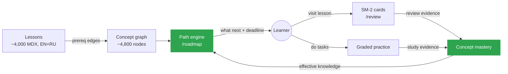
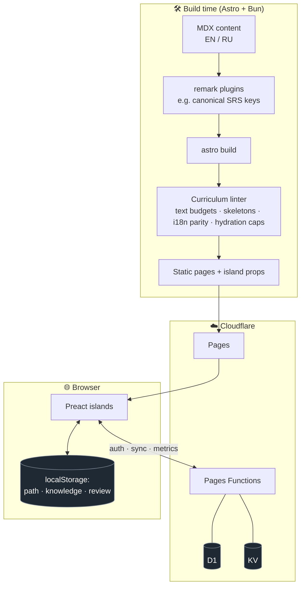

<div align="center">

# 🗺️ open atlas

### One connected atlas for becoming a senior fullstack engineer — bilingual (EN / RU), free, and open.

From counting and propositional logic all the way up to distributed systems, system-design cases, and production observability — every lesson is a node in one graph, wired with prerequisites, graded practice, spaced repetition, and a learning path that knows what you should study next.

<br/>

[](https://fallowlone.com)
[](./LICENSE)
[](./LICENSE-CONTENT.md)


<br/>

**[Explore the site »](https://fallowlone.com)** · [Learning path](https://fallowlone.com/en/roadmap) · [Tracks](#-whats-inside) · [Architecture](#%EF%B8%8F-architecture) · [Develop](#-develop)

<br/>


</div>

---

## ✨ Why open atlas

Most courses are a flat list of videos. **open atlas is a graph.** ~4,800 concepts are connected by prerequisite edges across 38 tracks, so the site can answer the question a real learner actually has — *"given what I know and where I want to go, what do I study next, and in what order?"* — and then schedule it against a deadline, drill it with graded practice, and bring it back for review before you forget it.

Everything is authored to a **middle+/senior depth bar**: mechanism → tradeoff → failure mode → real numbers. If a lesson reads like documentation, it's too shallow.

> **38 tracks · ~2,900 lessons (every one in EN + RU) · ~5,800 static pages · ~4,800-concept graph · i18n parity enforced at build time.**

---

## 📸 Screenshots

<table>
  <tr>
    <td width="50%" valign="top">
      <a href="docs/screenshots/roadmap.png"></a>
      <p align="center"><b>/roadmap</b> — the path engine: what to learn next, in order, on a deadline.</p>
    </td>
    <td width="50%" valign="top">
      <a href="docs/screenshots/lesson.png"></a>
      <p align="center"><b>A lesson</b> — depth tiers (Foundations → Senior), prerequisites, progress.</p>
    </td>
  </tr>
  <tr>
    <td width="50%" valign="top">
      <a href="docs/screenshots/english.png"></a>
      <p align="center"><b>/english</b> — English for Engineers: review → input → output, with coverage.</p>
    </td>
    <td width="50%" valign="top">
      <a href="docs/screenshots/home.png"></a>
      <p align="center"><b>/</b> — the atlas: 38 tracks of fullstack, CS, and math.</p>
    </td>
  </tr>
</table>

### 🌗 Light & dark

Every surface ships both themes (toggle in the header; remembers your choice).

<table>
  <tr>
    <td width="50%" valign="top"><a href="docs/screenshots/home.png"></a><p align="center"><b>Light</b></p></td>
    <td width="50%" valign="top"><a href="docs/screenshots/home-dark.png"></a><p align="center"><b>Dark</b></p></td>
  </tr>
</table>

---

## 📚 Table of contents

- [What's inside](#-whats-inside)
- [Screenshots](#-screenshots)
- [How the learning engine works](#-how-the-learning-engine-works)
- [Architecture](#%EF%B8%8F-architecture)
- [Tech stack](#-tech-stack)
- [Project structure](#-project-structure)
- [Develop](#-develop)
- [Quality gates](#-quality-gates)
- [Contributing](#-contributing)
- [License](#-license)

---

## 🧭 What's inside

| Area | What it is |
|------|-----------|
| **Tracks** | math, logic, algorithms, base CS, networking, frontend, backend, databases, SQL/Postgres, TypeScript, JS engine, React, Next.js, Node, NestJS, Go, Python, AWS, CI/CD, distributed systems, security, observability, system design (+ cases), and more. |
| **Practice** | Every teaching lesson ships graded tasks — `predict` / `diagnose` / `fix` / `design` / `incident` / `review` / `debug` / `sandbox` — with an in-browser runner (QuickJS / PGlite). |
| **Learning path** (`/roadmap`) | A concept-graph engine over ~4,800 concepts: *what to learn next*, in what order, with deadline scheduling and adaptive calibration. |
| **Spaced repetition** (`/review`) | SM-2 cards harvested from the lessons you visit; grades feed back into concept mastery. |
| **English for Engineers** (`/english`) | Vocabulary, reading, grammar, and speaking practice aimed at B2 — built on its own FSRS scheduler. |
| **Projects & capstones** | Non-template builds that exercise the curriculum end-to-end. |

---

## 🧠 How the learning engine works

The site isn't a content dump — it's a closed feedback loop between what you read, what you practice, and what it decides you should see next.



Mastery **decays** as a non-persisted read-model, so concepts you haven't touched quietly re-enter your path — no manual bookkeeping. Retrieval grades and practice outcomes both flow into the same mastery signal that the path engine plans against.

---

## 🏗️ Architecture

Static-first by default, with a thin serverless layer for the things that genuinely need state.



**Content that breaks the pedagogy rules fails the build.** The custom linter enforces text budgets, lesson skeletons, EN↔RU parity + glossary, sources, depth checkpoints, and a per-page hydration cap — so quality is a CI gate, not a code-review hope.

---

## 🧰 Tech stack

| Layer | Choice |
|-------|--------|
| **Framework** | [Astro 6](https://astro.build) — static output, islands architecture |
| **UI** | [Preact](https://preactjs.com) islands + [Tailwind](https://tailwindcss.com), GSAP for motion |
| **Content** | MDX content collections, bilingual EN/RU, build-time remark plugins |
| **In-browser runtimes** | [QuickJS](https://github.com/justjake/quickjs-emscripten) (JS sandboxes) · [PGlite](https://github.com/electric-sql/pglite) (Postgres in WASM) |
| **Edge** | Cloudflare Pages + Pages Functions + D1 + KV |
| **Auth & sync** | GitHub sign-in, progress sync, anonymous usage metrics, reader questions |
| **Tooling** | [Bun](https://bun.sh) · [Vitest](https://vitest.dev) · [Playwright](https://playwright.dev) |
| **CI/CD** | GitHub Actions → tests → runnable-sample verification → build → Cloudflare Pages |

---

## 📂 Project structure

```text
.
├── site/                       # Astro app (canonical output)
│   ├── src/
│   │   ├── content/lessons/    # {en,ru}/<track>/<unit>/<lesson>/index.mdx
│   │   ├── components/         # prose · layout · diagram · pedagogy · nav islands
│   │   ├── scripts/            # path engine, SM-2 review, knowledge model, i18n
│   │   ├── lib/                # build-time remark plugins
│   │   ├── lint/               # the curriculum linter rules
│   │   └── pages/              # routes (/learn, /roadmap, /review, /english …)
│   └── scripts/                # build, audit, and verification tooling
├── functions/                  # Cloudflare Pages Functions (API) + tests
├── docs/superpowers/           # specs & implementation plans
├── curriculum.md               # depth bar + pillar/track map (source of truth)
└── style-guide.md              # visual rules + component vocabulary
```

---

## 🚀 Develop

```bash
# prerequisites: bun (https://bun.sh)

cd site
bun install
bun run dev      # local dev server at http://localhost:4321

bun run build    # astro build + curriculum lint (expects 0 errors / 0 warnings)
bun run test     # unit tests (vitest)

cd ../functions
bun run test     # API tests
```

Deploy is automated via GitHub Actions (`.github/workflows/deploy.yml`): **tests → runnable-sample verification → build → Cloudflare Pages.**

---

## ✅ Quality gates

This repo treats correctness of *content* like correctness of code:

- 🧱 **Curriculum linter** — text budgets, lesson skeletons, i18n parity + glossary, required sources, hydration caps. Violations fail the build.
- 🧪 **1,144 unit tests** across the path engine, review/SRS, knowledge model, and lint rules.
- ▶️ **Runnable code samples** — lesson snippets tagged ` ```js run ` actually execute under Bun in CI; a snippet that crashes blocks the deploy.
- 🌐 **EN ↔ RU parity** — every lesson exists in both languages or the build refuses.
- 🎭 **Playwright** E2E for critical flows.

---

## 🤝 Contributing

Issues and PRs are welcome. A few conventions:

- **Conventional commits** (`feat:`, `fix:`, `docs:`, `refactor:`, `test:`, `chore:`).
- Run `bun run build` (in `site/`) before opening a PR touching content — the linter is the gate.
- New lessons are **bilingual or rejected**; add new terms to the glossary.
- Keep islands lean — there's a per-page hydration cap.

See `curriculum.md` for the depth bar and `style-guide.md` for visual conventions.

---

## 📄 License

| | |
|---|---|
| **Code** | [MIT](./LICENSE) |
| **Content** (lessons, practice, curriculum data) | [CC BY-SA 4.0](./LICENSE-CONTENT.md) |

<div align="center">
<br/>

**[fallowlone.com](https://fallowlone.com)** — built to learn in the open.

</div>
